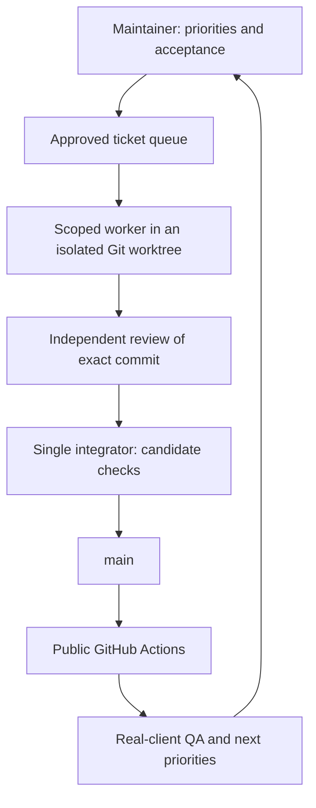

# How we build with AI agents

[← Back to the project](../README.md)

We use **[Hermes Agent](https://hermes-agent.nousresearch.com/docs/)** to work on a clean-room, legacy-compatible Metin2 server in Go. The goal is demonstrated compatibility and playable milestones—not a stream of commits.

## From a goal to a tested change

**Five specialties, one product:** world, combat, items, content and persistence. Each has its own lane branch/worktree. Only approved tickets with satisfied dependencies are eligible; workers do not invent another micro-slice every time a timer fires.

The queue caps **global work in progress at two tickets**, including work waiting for review/integration. This is not a claim of two concurrent processes: the currently installed scheduler executes workdir jobs serially. Independent branches protect edits, not runtime concurrency.

## Worker contract

1. Read the assigned acceptance criteria and allowed paths.
2. Claim ownership with a time-limited lease; inspect existing Git state.
3. Preserve interrupted work. An expired claim blocks for explicit recovery rather than assigning dirty work to another run.
4. Implement one coherent contract/behavior/test/docs change and run relevant tests.
5. Push only the assigned lane and record the exact result SHA and actual checks.

Short project policy and relevant specs are the default context. Deep historical plans and large QA catalogs remain references, not mandatory reading on every tick. Specialized skills are loaded when needed.

Workers have staggered three-hour opportunities; integration checks for eligible work more frequently. No ticket, maintenance drain or recent quota exhaustion means the preflight suppresses the model call. Timers are opportunities—not promised commits or completion deadlines.

## Integration and evidence

A single integrator checks the result against Git: base/result SHAs, expected branch, clean tree and allowed paths. It consumes an **independent review tied to the exact implementation SHA** before preparing a linear candidate. Dispatching a reviewer is not approval.

- Runtime candidates: formatting, focused regression checks, full Go tests and `go vet` before push.
- Documentation-only candidates: relevant document checks.
- CI/helper changes: helper tests and workflow review, plus applicable regression checks.
- Server binaries and runtime/debug images are built by public CI; local automation does not deploy or restart game services.

GitHub Actions uses a lightweight path for Markdown-only changes and the full checks for code, workflows and helper scripts. A final aggregate job reports the applicable result; this alone does not configure GitHub branch protection. Public CI runs **after push** and can still uncover a problem missed locally.

Unexpected repository state, scope conflicts or failing checks stop integration. Pending lane work is preserved. Claims and reviewer identifiers are trusted workflow metadata, not OS sandboxing or cryptographic identities.

## Human direction and feedback

The maintainer approves priorities, resolves ambiguous compatibility decisions and performs real-client QA. Automated integration is not universal human review of every commit.

A dirty-worktree guard, read-only CI watchdog and daily digest report meaningful blockers and progress. Detailed worker output stays private. Provider failures are kept low-noise, and a successful scheduled run is not proof that a feature is complete.

**The first PvE journey is a checkpoint, not the final product.** Full legacy compatibility remains the direction. A green suite does not establish client compatibility, economic safety under every failure, or production readiness. Manual results stay pending until exercised against identified builds.

## Follow the project

- [Current roadmap](roadmap.md) — milestones and next acceptance gates.
- [Client smoke test](qa/smoke.md) — short player journey and evidence template.
- [Commit history](https://github.com/MikelCalvo/go-metin2-server/commits/main/) · [Public CI](https://github.com/MikelCalvo/go-metin2-server/actions).
- [Technical roadmap archive](plans/2026-08-08-playable-vertical-roadmap.md) · [Detailed regression checklist](qa/manual-client-checklist.md).
- [Clean-room policy](clean-room-policy.md) — behavior observations are references; legacy source is not copied.

September 2026 workflow. Private infrastructure, credentials and scheduler state are intentionally outside the public repository.
