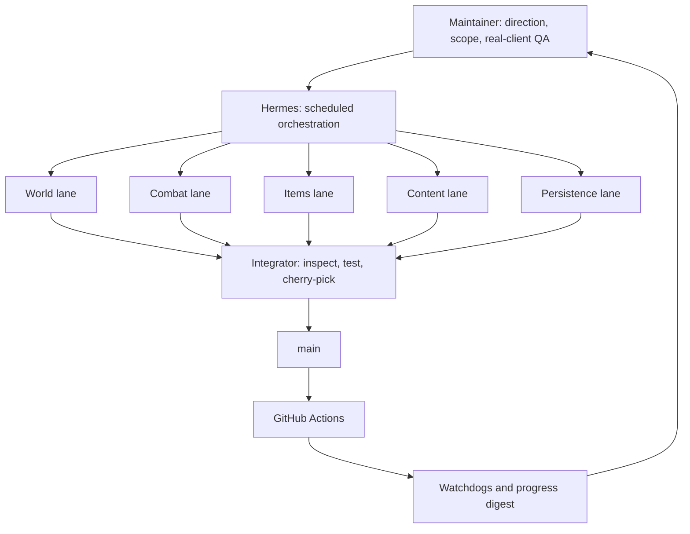

# How we build with AI agents

[← Back to the project](../README.md)

This project is developed with **[Hermes Agent](https://hermes-agent.nousresearch.com/docs/)**, a maintainer, and a set of scheduled development workers. AI assistance is part of the engineering process, not just a tool used to write occasional snippets: workers can inspect the repository, implement small changes, run tests, commit, and push to their assigned branches.

The aim is **parallel progress with a controlled integration point**, not five agents editing `main` at once.

## The setup at a glance

**In plain text:** maintainer priorities → isolated worker branches → integration checks → `main` → public CI and feedback.

### Five focused lanes

Each lane has its own **Git worktree**: a separate working directory and branch in the same repository. That isolates edits, although it does not eliminate conflicts in shared files.

| Lane | Branch | Primary responsibility |
| :--- | :--- | :--- |
| World | `lane/world` | Mob AI, spawn lifecycle, movement, visibility, and world recovery. |
| Combat | `lane/combat` | Attacks, rewards, player death, and restart behavior. |
| Items | `lane/items` | Inventory, equipment, trade, storage, and economy safety. |
| Content | `lane/content` | Authored NPC services, content bundles, and quest-state behavior. |
| Persistence | `lane/persistence` | Data contracts, migrations, recovery, and operator tooling. |

These are ownership guidelines, not separate products. Every lane should help the same goal: a coherent, recoverable PvE loop.

## What happens during a worker run?

1. **Check the starting point.** Inspect local changes, fetch the latest branches, and safely align with `main`. Interrupted work is inspected rather than blindly discarded.
2. **Choose a small, useful change.** Prefer player-visible behavior or recovery safety over internal churn.
3. **Document the contract.** When a change affects client behavior, freeze the expected behavior in project-owned notes/specs before implementation.
4. **Implement and test.** Add focused tests, run relevant package checks, format touched Go files, and check the diff.
5. **Commit to the lane only.** Leave a concise handoff explaining the change, checks performed, and next useful step.

Workers load reusable **skills**: procedural notes for the subsystem and workflow. Those notes help preserve conventions across runs, while the repository's specs, tests, and current code provide the shared evidence.

The current setup runs workers and the integrator on **staggered three-hour schedules**, with a daily strategic digest. This is a scheduling cadence, not a promise of a commit every three hours: a run may find no safe work, encounter a blocker, or leave a change for follow-up.

Workers are instructed not to push `main` or modify the scheduler. The configured workflow does not launch external autonomous coding CLIs; Hermes subdelegation is allowed for analysis/review, while the responsible worker retains the final diff, test, commit, and push decisions. These are workflow rules, not a claim of OS-level sandboxing.

## How changes reach `main`

A separate **integrator** owns automated integration. It checks for unique lane changes, inspects their scope, and brings accepted commits into `main` one at a time using cherry-picks, keeping the history linear.

Its configured gate includes:

- formatting and whitespace checks;
- the full Go test suite;
- `go vet`;
- builds of the server daemons and migration CLI.

The integrator pushes after local checks, then realigns the integrated lane so the same patch is not picked again. Small mechanical conflicts can be resolved automatically; ambiguous scope, unexpected repository state, or failing checks should stop integration and be reported.

**GitHub Actions is a second, public check after the push**, not a required pre-push approval service. It also checks runtime/debug Docker images and build identity. The goal is a green `main`, but local success does not guarantee CI success.

Maintainer-directed changes can also go directly to `main`; the lane integrator is the automated integration path, not the only possible author of a commit.

## Monitoring without a wall of notifications

- **Dirty-lane guard:** detects worktrees left with unfinished changes for inspection/recovery.
- **CI watchdog:** diagnoses and reports a failing public pipeline; it is read-only unless the maintainer requests action.
- **Strategic digest:** summarizes branch health, pending work, and whether progress still serves the playable milestone.
- **Private reports:** worker detail stays local; integration summaries and meaningful health updates go to the maintainer through Telegram.

Expected transient provider/auth/quota failures are kept low-noise rather than generating repeated chat alerts. A clean worktree or successful scheduled run still does **not** mean a subsystem is finished.

For shared documentation or cross-lane maintenance, we pause the relevant jobs, check for in-flight work, make the change, realign branches without losing pending work, and resume the original schedules.

## Where the human stays in the loop

The maintainer sets priorities, approves direction changes, investigates ambiguous compatibility questions, and performs real-client QA. Automated workers can commit and integrate without a human approving each individual commit; we do not present this as universal human code review.

Important limits:

- **Tests are evidence for specific behavior**, not proof of full Metin2 compatibility or production safety.
- **Automated review can miss bugs**, including bugs shared by an implementation and its tests.
- **An agent report is not proof of success.** Commits, diffs, test results, CI, and reproducible client behavior matter more than the summary.
- **The game client remains a separate validation step.** A green test suite does not mean a player journey has been manually tested.
- **Clean-room rules apply equally to agents and humans.** Legacy behavior can be an external reference, but legacy source must not be copied into the project.

## Follow the evidence

- [Commit history](https://github.com/MikelCalvo/go-metin2-server/commits/main/) — what actually landed.
- [GitHub Actions](https://github.com/MikelCalvo/go-metin2-server/actions) — public check results.
- [Living PvE roadmap](plans/2026-08-08-playable-vertical-roadmap.md) — detailed implementation progress and remaining scope.
- [Manual client QA checklist](qa/manual-client-checklist.md) — player journeys to exercise.
- [Engineering workflow](workflow.md) · [Testing strategy](testing-strategy.md) · [Clean-room policy](clean-room-policy.md).

This note describes the workflow as of **September 2026**. Credentials, private infrastructure addresses, local paths, and raw scheduler configuration are intentionally not part of the public documentation.
